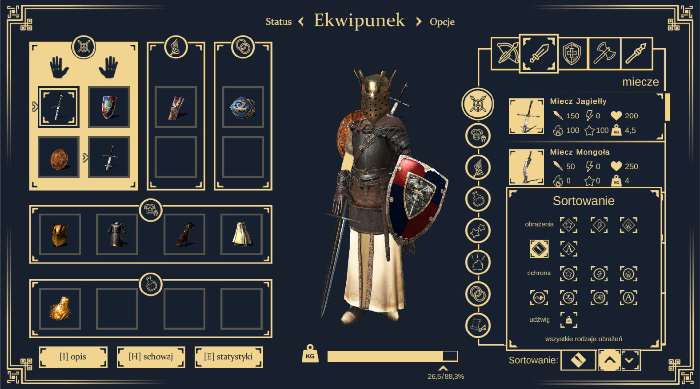
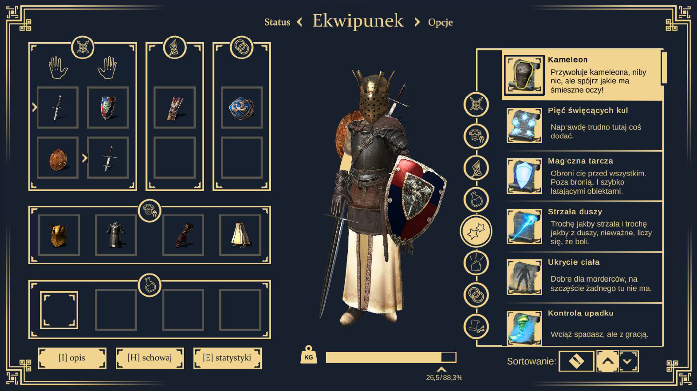
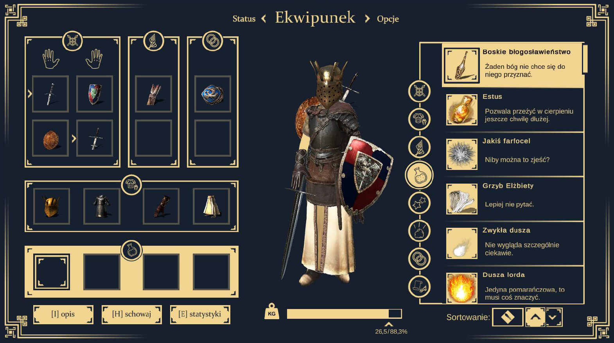
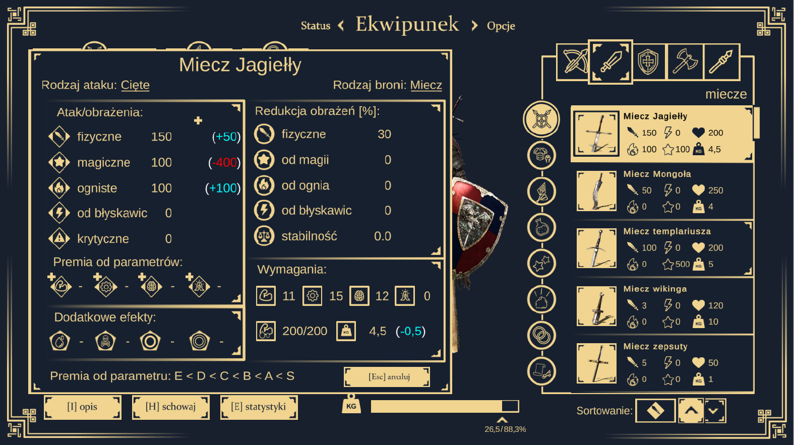
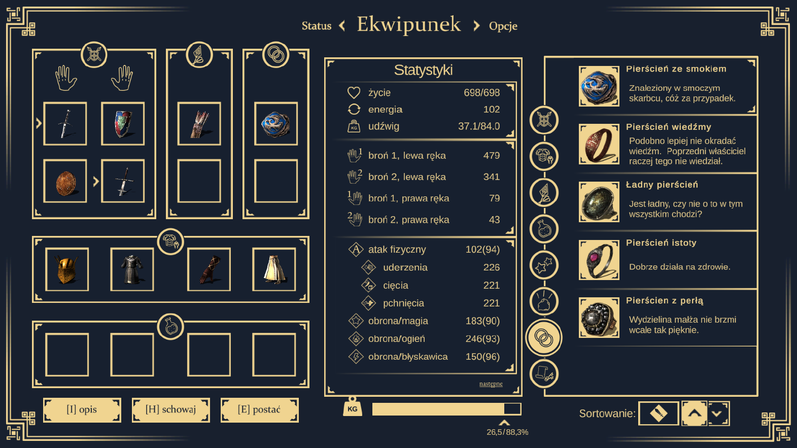

# O projekcie / About project

PL-- Przeprojektowanie interfejsu graficznego użytkownika gry **Dark Souls: Prepare to Die Edition** realizowany w ramach przedmiotu **"Projektowanie interfejsów w grach komputerowych"** na **Politechnice Łódzkiej**. 

EN-- Redesign of the graphical user interface of **Dark Souls: Prepare to Die Edition**. Project is as part of the **"Interface design in computer games"** at the **Lodz University of Technology**.

## Efekty pracy / Work effects

